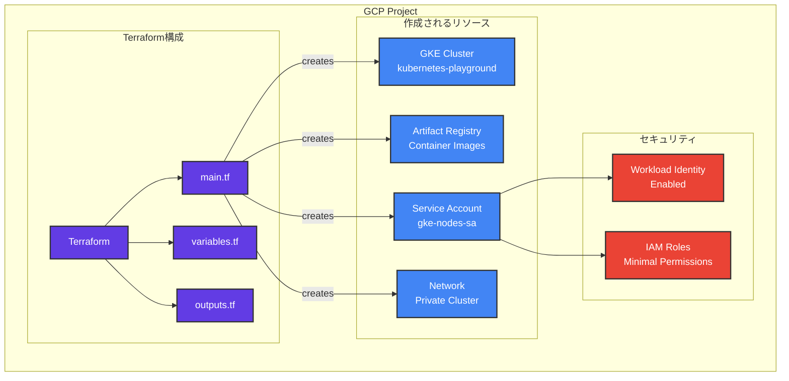
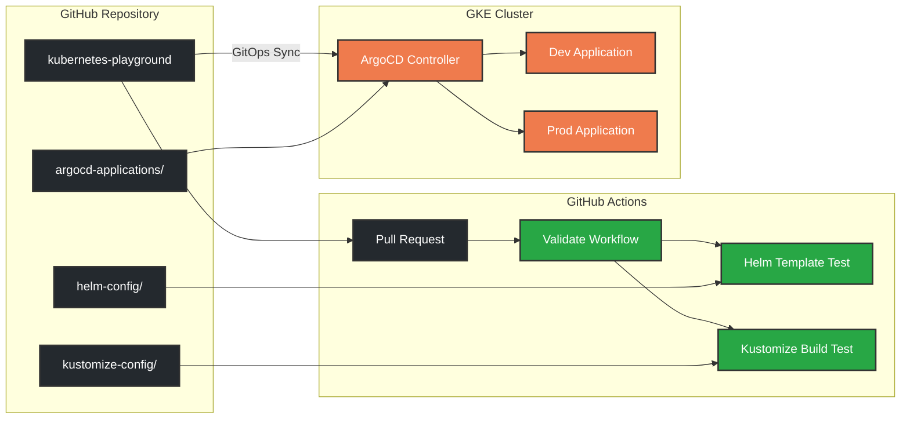
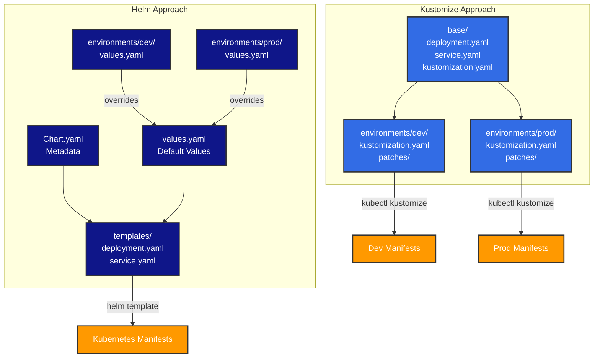
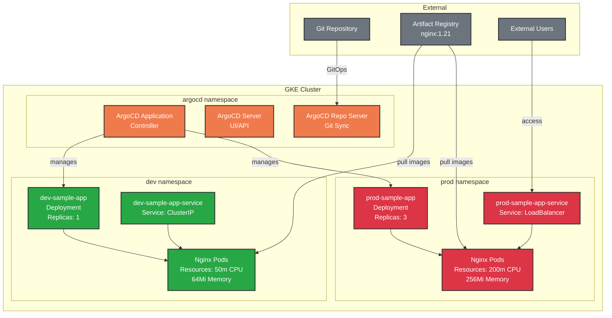

# Kubernetes Playground - GKE CI/CD with ArgoCD

このプロジェクトでは、GKEにおけるCI/CDの仕組みを試すために、ArgoCD + Helm と ArgoCD + Kustomize の二つの構成を実装しています。

## 🏗️ アーキテクチャ

### フォルダ構成
```
📁 kubernetes-playground/
├── 🛠️ helm-config/              # Helm構成
│   ├── apps/sample-app/         # Helmチャート
│   └── environments/            # 環境別設定
│       ├── dev/values.yaml
│       └── prod/values.yaml
├── 🔧 kustomize-config/         # Kustomize構成  
│   ├── base/                    # ベースマニフェスト
│   └── environments/            # 環境別オーバーレイ
│       ├── dev/
│       └── prod/
├── 🚀 argocd-applications/      # ArgoCD Application定義
├── 🏭 gke-setup/               # GKEセットアップ
│   ├── terraform/              # インフラ構成
│   └── scripts/                # デプロイスクリプト
└── 🔄 .github/workflows/       # CI/CD パイプライン
```

### システム構成図

#### 1. インフラストラクチャ層



#### 2. CI/CDパイプライン



#### 3. 設定管理の比較



#### 4. Kubernetes クラスター内部構成



## 🚀 クイックスタート

### 1. 前提条件

以下のツールがインストールされていることを確認してください：
- [gcloud CLI](https://cloud.google.com/sdk/docs/install)
- [Terraform](https://learn.hashicorp.com/tutorials/terraform/install-cli)
- [kubectl](https://kubernetes.io/docs/tasks/tools/)
- [Helm](https://helm.sh/docs/intro/install/)

### 2. GCPプロジェクトの設定

```bash
# gcloud認証
gcloud auth login
gcloud auth application-default login

# プロジェクトを設定
gcloud config set project YOUR_PROJECT_ID
```

### 3. Terraform設定

```bash
# 設定ファイルをコピーして編集
cp gke-setup/terraform/terraform.tfvars.example gke-setup/terraform/terraform.tfvars

# YOUR_PROJECT_IDを実際のプロジェクトIDに変更
vim gke-setup/terraform/terraform.tfvars
```

### 4. GKEクラスターの作成

```bash
# 自動セットアップスクリプトを実行
./gke-setup/scripts/setup-gke.sh
```

### 5. ArgoCDのインストール

```bash
# ArgoCDをインストール
./gke-setup/scripts/install-argocd.sh
```

### 6. アプリケーションのデプロイ

```bash
# アプリケーションをデプロイ
./gke-setup/scripts/deploy-applications.sh
```

## 📊 構成の比較

| 項目 | Helm | Kustomize |
|------|------|-----------|
| **設定方法** | Values files | Patches |
| **テンプレート** | Go template | YAML merge |
| **環境差分** | `-f values.yaml` | Overlay |
| **複雑度** | 中程度 | シンプル |
| **再利用性** | 高い | 中程度 |

### Helm構成の特徴
- テンプレート化による柔軟性
- Values filesによる環境別設定
- パッケージ化と配布が容易

### Kustomize構成の特徴
- YAMLマニフェストベース
- Patchによる差分管理
- Kubernetesネイティブ

## 🔄 CI/CD パイプライン

GitHub Actionsを使用して以下を自動化：

- **Helmバリデーション**
  - `helm template` による構文チェック
  - 環境別設定のテスト
  - `helm lint` によるベストプラクティス確認

- **Kustomizeバリデーション** 
  - `kubectl kustomize` による構文チェック
  - 環境別オーバーレイのテスト

## 🌐 アクセス方法

### ArgoCD UI
```bash
# ポートフォワード
kubectl port-forward svc/argocd-server -n argocd 8080:443

# ブラウザで https://localhost:8080 にアクセス
# ユーザー名: admin
# パスワード: install-argocd.sh実行時に表示される
```

### アプリケーション
```bash
# dev環境のサービス確認
kubectl get services -n dev

# prod環境のサービス確認  
kubectl get services -n prod

# ポートフォワードでアクセス
kubectl port-forward -n dev svc/dev-sample-app-service 8081:80
```

## 🧹 クリーンアップ

```bash
# ArgoCD Applicationsを削除
kubectl delete -f argocd-applications/

# GKEクラスターを削除
cd gke-setup/terraform
terraform destroy

# 確認が求められるのでyesを入力
```

## 📚 参考リンク

- [ArgoCD Documentation](https://argo-cd.readthedocs.io/)
- [Helm Documentation](https://helm.sh/docs/)
- [Kustomize Documentation](https://kustomize.io/)
- [GKE Documentation](https://cloud.google.com/kubernetes-engine/docs)