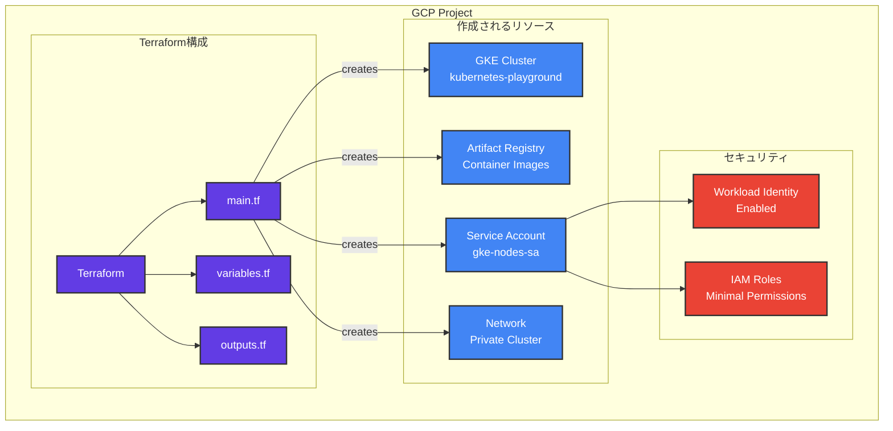
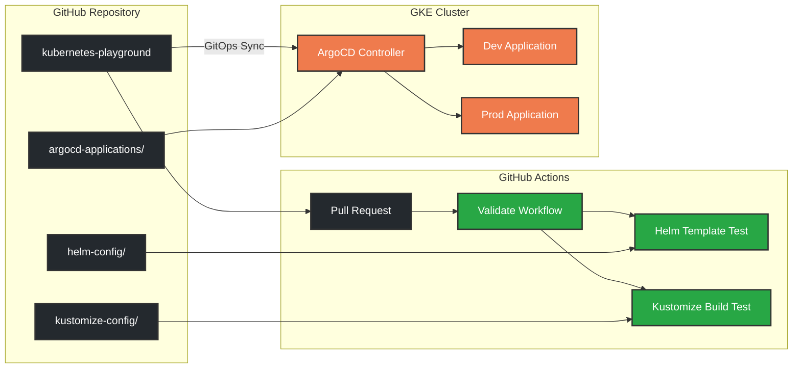
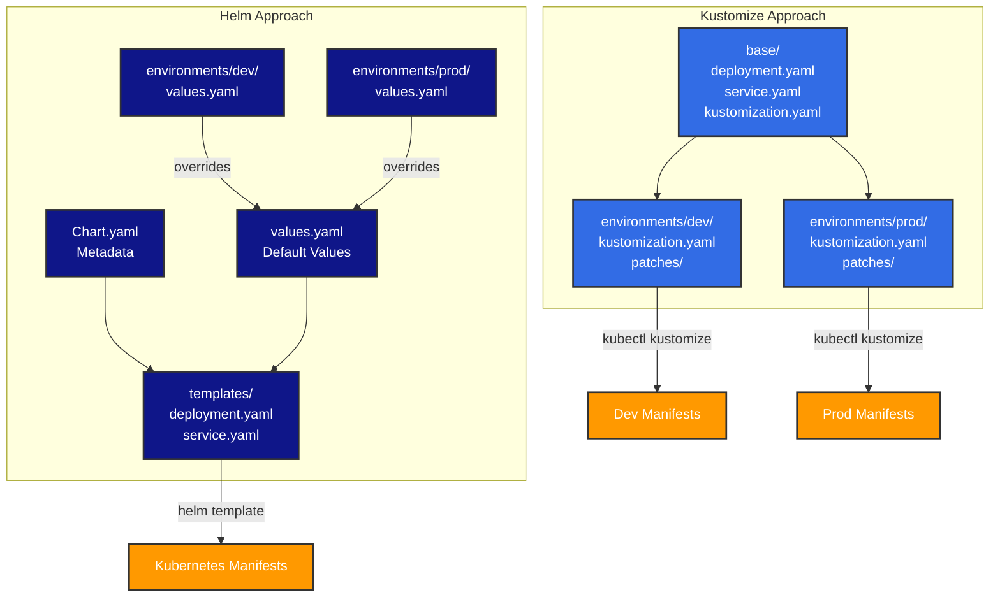
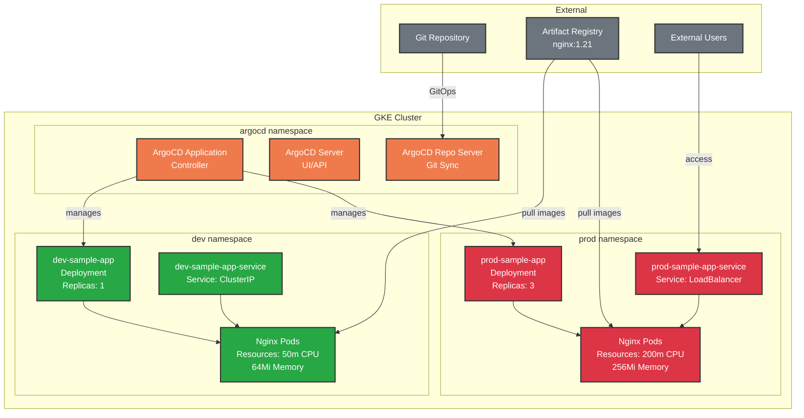

# Kubernetes Playground - GKE CI/CD with ArgoCD

このプロジェクトでは、GKEにおけるCI/CDの仕組みを試すために、ArgoCD + Helm と ArgoCD + Kustomize の二つの構成を実装しています。

## 🏗️ アーキテクチャ

### フォルダ構成
```
📁 kubernetes-playground/
├── 🛠️ helm-config/              # Helm構成
│   ├── apps/sample-app/         # Helmチャート
│   └── environments/            # 環境別設定
│       ├── dev/values.yaml
│       └── prod/values.yaml
├── 🔧 kustomize-config/         # Kustomize構成  
│   ├── base/                    # ベースマニフェスト
│   └── environments/            # 環境別オーバーレイ
│       ├── dev/
│       └── prod/
├── 🚀 argocd-applications/      # ArgoCD Application定義
├── 🏭 gke-setup/               # GKEセットアップ
│   ├── terraform/              # インフラ構成
│   └── scripts/                # デプロイスクリプト
└── 🔄 .github/workflows/       # CI/CD パイプライン
```

### システム構成図

#### 1. インフラストラクチャ層



#### 2. CI/CDパイプライン



#### 3. 設定管理の比較



#### 4. Kubernetes クラスター内部構成



## 🚀 クイックスタート

### 1. 前提条件

以下のツールがインストールされていることを確認してください：
- [gcloud CLI](https://cloud.google.com/sdk/docs/install) + GKE Auth Plugin
- [Terraform](https://learn.hashicorp.com/tutorials/terraform/install-cli)
- [kubectl](https://kubernetes.io/docs/tasks/tools/)
- [Helm](https://helm.sh/docs/intro/install/)

```bash
# GKE Auth Pluginのインストール（必須）
gcloud components install gke-gcloud-auth-plugin
```

### 2. リポジトリのクローン & 設定

```bash
# リポジトリをクローン
git clone https://github.com/YOUR_USERNAME/kubernetes-playground.git
cd kubernetes-playground

# gcloud認証
gcloud auth login
gcloud auth application-default login

# プロジェクトを設定
gcloud config set project YOUR_PROJECT_ID
```

### 3. Terraform設定

```bash
# terraform.tfvarsファイルを作成
cd gke-setup/terraform
cat > terraform.tfvars << EOF
project_id = "YOUR_PROJECT_ID"
region = "asia-northeast1"
cluster_name = "kubernetes-playground"
node_count = 1
machine_type = "e2-standard-2"
EOF
```

### 4. インフラストラクチャの構築

```bash
# Terraformでインフラを構築
terraform init
terraform plan
terraform apply
```

**重要な注意事項：**
- プライベートクラスターの場合、外部レジストリ（quay.io等）からのイメージ取得に問題が生じる可能性があります
- その場合は `main.tf` の `private_cluster_config` で `enable_private_nodes = false` に設定してください

### 5. kubectl接続設定

```bash
# クラスターへの接続設定を取得
gcloud container clusters get-credentials kubernetes-playground --region asia-northeast1

# 接続確認
kubectl get nodes
```

### 6. ArgoCDのインストール

```bash
# ArgoCD namespaceを作成
kubectl create namespace argocd

# ArgoCDをインストール
kubectl apply -n argocd -f https://raw.githubusercontent.com/argoproj/argo-cd/stable/manifests/install.yaml

# ArgoCDの起動を待機（2-3分）
kubectl wait --for=condition=available --timeout=300s deployment/argocd-server -n argocd

# 管理者パスワードを取得
kubectl -n argocd get secret argocd-initial-admin-secret -o jsonpath="{.data.password}" | base64 -d; echo
```

### 7. ArgoCD GUIへのアクセス

```bash
# ポートフォワードでArgoCD UIにアクセス
kubectl port-forward svc/argocd-server -n argocd 8080:443

# 別のターミナルで実行するか、バックグラウンドで実行する場合
kubectl port-forward svc/argocd-server -n argocd 8080:443 &
```

**ArgoCD GUI アクセス情報：**
- URL: https://localhost:8080
- ユーザー名: `admin`
- パスワード: 手順6で取得したパスワード

**GUI画面の説明：**
- **Applications**: デプロイされたアプリケーションの一覧
- **Sync Status**: GitリポジトリとKubernetesクラスターの同期状態
- **Health Status**: アプリケーションの健全性状態
- **App Details**: 各アプリケーションをクリックすると、リソースの詳細とトポロジー表示

### 8. ArgoCD Applicationsのデプロイ

```bash
# ArgoCD Applicationsをデプロイ（リポジトリURLを自分のものに変更）
cd ../../argocd-applications
kubectl apply -f .

# Applications確認
kubectl get applications -n argocd
```

### 9. GitOpsワークフローのテスト

```bash
# 変更例: dev環境のnginxバージョンを更新
# helm-config/environments/dev/values.yaml の image.tag を変更
# または kustomize-config/base/deployment.yaml の image を変更

# 変更をコミット＆プッシュ
git add .
git commit -m "Test GitOps: Update nginx version"
git push origin main

# ArgoCD が自動的に検知・同期（約3分以内）
# CLI で確認
kubectl get applications -n argocd -w

# または ArgoCD GUI (https://localhost:8080) で視覚的に確認
```

## 📊 構成の比較

| 項目 | Helm | Kustomize |
|------|------|-----------|
| **設定方法** | Values files | Patches |
| **テンプレート** | Go template | YAML merge |
| **環境差分** | `-f values.yaml` | Overlay |
| **複雑度** | 中程度 | シンプル |
| **再利用性** | 高い | 中程度 |

### Helm構成の特徴
- テンプレート化による柔軟性
- Values filesによる環境別設定
- パッケージ化と配布が容易

### Kustomize構成の特徴
- YAMLマニフェストベース
- Patchによる差分管理
- Kubernetesネイティブ

## 🔄 CI/CD パイプライン

GitHub Actionsを使用して以下を自動化：

- **Helmバリデーション**
  - `helm template` による構文チェック
  - 環境別設定のテスト
  - `helm lint` によるベストプラクティス確認

- **Kustomizeバリデーション** 
  - `kubectl kustomize` による構文チェック
  - 環境別オーバーレイのテスト

## 🌐 アクセス方法

### ArgoCD UI
```bash
# ポートフォワード
kubectl port-forward svc/argocd-server -n argocd 8080:443

# ブラウザで https://localhost:8080 にアクセス
# ユーザー名: admin
# パスワード: install-argocd.sh実行時に表示される
```

### アプリケーション
```bash
# dev環境のサービス確認
kubectl get services -n dev

# prod環境のサービス確認  
kubectl get services -n prod

# ポートフォワードでアクセス
kubectl port-forward -n dev svc/dev-sample-app-service 8081:80
```

## 🔧 トラブルシューティング

### よくある問題と解決方法

#### 1. ArgoCD Applicationsが OutOfSync のまま

```bash
# Application詳細を確認
kubectl describe application sample-app-helm-dev -n argocd

# 手動で同期をトリガー（テスト目的のみ）
kubectl patch application sample-app-helm-dev -n argocd --type merge --patch '{"operation":{"sync":{"revision":"HEAD"}}}'
```

#### 2. プライベートクラスターでイメージ取得エラー

Terraformの `main.tf` を編集：
```hcl
private_cluster_config {
  enable_private_nodes    = false  # true から false に変更
  enable_private_endpoint = false
}
```

再適用：
```bash
cd gke-setup/terraform
terraform apply
```

#### 3. kubectl接続エラー

```bash
# GKE Auth Pluginの再インストール
gcloud components install gke-gcloud-auth-plugin

# 認証情報の更新
gcloud container clusters get-credentials kubernetes-playground --region asia-northeast1
```

#### 4. ArgoCD GUI接続エラー

```bash
# ポートフォワードプロセスを確認・再起動
pkill -f "port-forward.*argocd"
kubectl port-forward svc/argocd-server -n argocd 8080:443 &
```

#### 5. GitOps同期が動作しない

```bash
# リポジトリURLが正しいか確認
kubectl get application sample-app-helm-dev -n argocd -o yaml | grep repoURL

# ArgoCD repo-serverログを確認
kubectl logs deployment/argocd-repo-server -n argocd
```

## 📈 実験結果の確認

### CLI での確認

```bash
# Applications状態
kubectl get applications -n argocd

# Pod の状態とイメージバージョン
kubectl get pods -n dev -o wide
kubectl describe pod -n dev -l app=sample-app | grep Image

# リソース使用量の比較
kubectl top pods -n dev
kubectl top pods -n prod
```

### GUI での確認

ArgoCD GUI (https://localhost:8080) では以下を確認できます：

1. **Applications Dashboard**: 4つのApplication（Helm dev/prod, Kustomize dev/prod）の状態
2. **Application Details**: 各Applicationをクリックしてリソースのトポロジー表示
3. **Sync History**: 過去の同期履歴と変更内容
4. **Events**: リアルタイムでの同期イベント監視

## 🧹 クリーンアップ

```bash
# ArgoCD Applicationsを削除
kubectl delete -f argocd-applications/

# ArgoCD自体を削除
kubectl delete namespace argocd

# GKEクラスターを削除
cd gke-setup/terraform
terraform destroy

# 確認が求められるのでyesを入力
```

## 📚 参考リンク

- [ArgoCD Documentation](https://argo-cd.readthedocs.io/)
- [Helm Documentation](https://helm.sh/docs/)
- [Kustomize Documentation](https://kustomize.io/)
- [GKE Documentation](https://cloud.google.com/kubernetes-engine/docs)